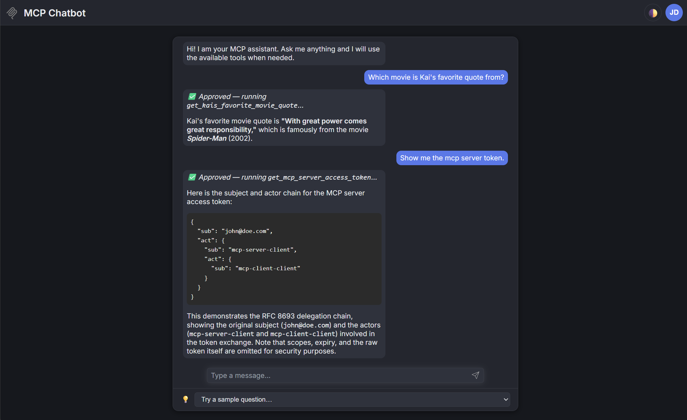

# Spring AI MCP Demos

This is a whole MCP stack written in Java with Spring Boot 4.0.x and Spring AI.
It implements several demos for the MCP server, MCP client and an Angular chatbot using deep-chat.

## Prepare your LLM

Edit the `mcp-client/src/main/resources/application.yaml` file and set your OpenAI settings.
If you want to use a local model, you could also configure Ollama.

## Starting the whole Stack

Two convenience scripts are provided at the repository root to start all four
services at once: the OAuth2 authorization server, the MCP server, the MCP
client and the Angular chatbot.

- **Windows**: `start-all.bat`
  - Opens one console window per service (auth server, MCP server, MCP
    client, chatbot). Close a window (or press Ctrl+C in it) to stop that
    service.
- **Linux/macOS**: `./start-all.sh`
  - Runs all services as background jobs of the script and writes their
    output to `logs/*.log`. Press Ctrl+C to stop everything.

Both scripts start the services in this order, with short delays so each
service is ready before the next one that depends on it starts:

1. MCP Authorization Server — http://localhost:9000
2. MCP Server — http://localhost:8082
3. MCP Client — http://localhost:8083
4. MCP Chatbot (Angular) — http://localhost:4200

## How to use the Chatbot

1. Open http://localhost:4200 in a browser.
2. Click **Sign in** and log in with the demo user:
   - Username: `john@doe.com`
   - Password: `john`
3. After a successful login you are redirected back to the app, the toolbar shows
   **John Doe**, and the deep-chat window connects to the mcp-client so you can start
   chatting.
4. Ask "Which movie is Kai's favorite quote from?"
5. Approve the tool call in the Chatbot
6. The chatbot will call the MCP client, which calls the MCP server, which calls the OpenAI API to get the answer.
7. Try "Write a haiku about the weather in Munich." and "What temperature unit do I prefer?"
   to see mcp-client's human-in-the-loop MCP sampling and elicitation support in action.

See [`mcp-client/COMPLIANCE.md`](mcp-client/COMPLIANCE.md) for how mcp-client maps to the
MCP client design guidelines (human-in-the-loop tool/sampling/elicitation approval, token
handling, timeouts, capability negotiation, ...).

## Licenses

- mcp-authorization-server is licensed under the Apache License, Version 2.0
- mcp-client is licensed under the Apache License, Version 2.0
- mcp-server is licensed under the Apache License, Version 2.0
- mcp-chatbot is licensed under the MIT License

